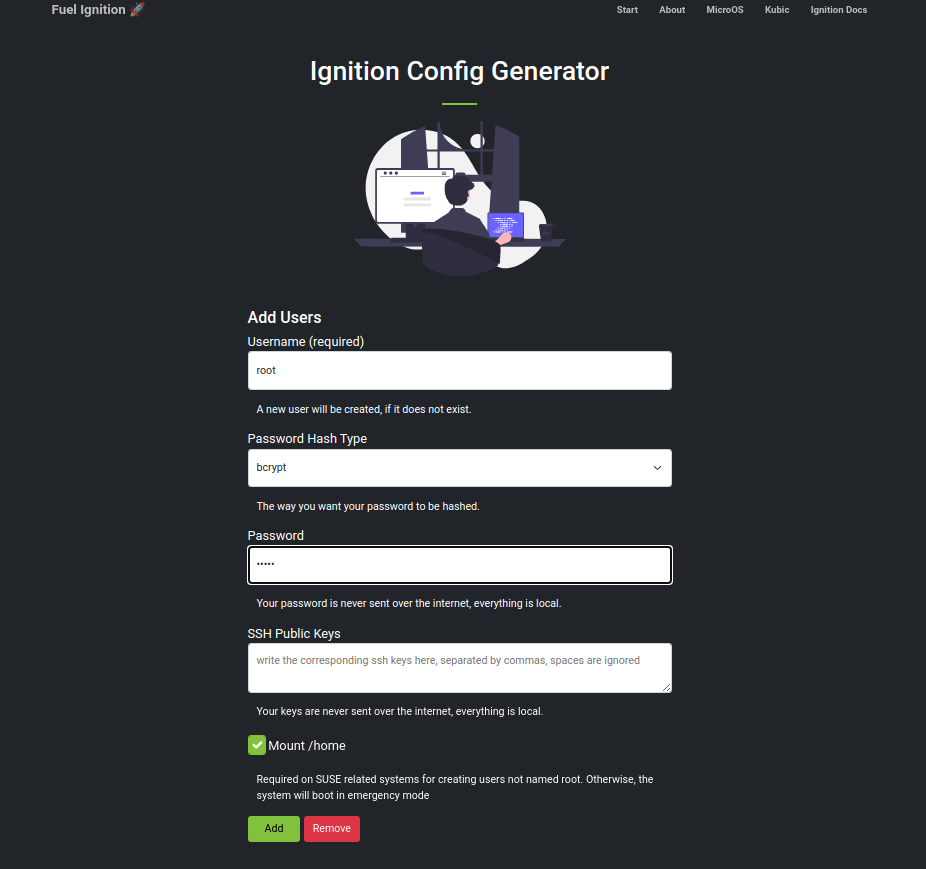
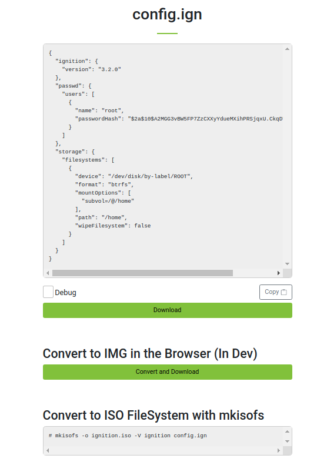
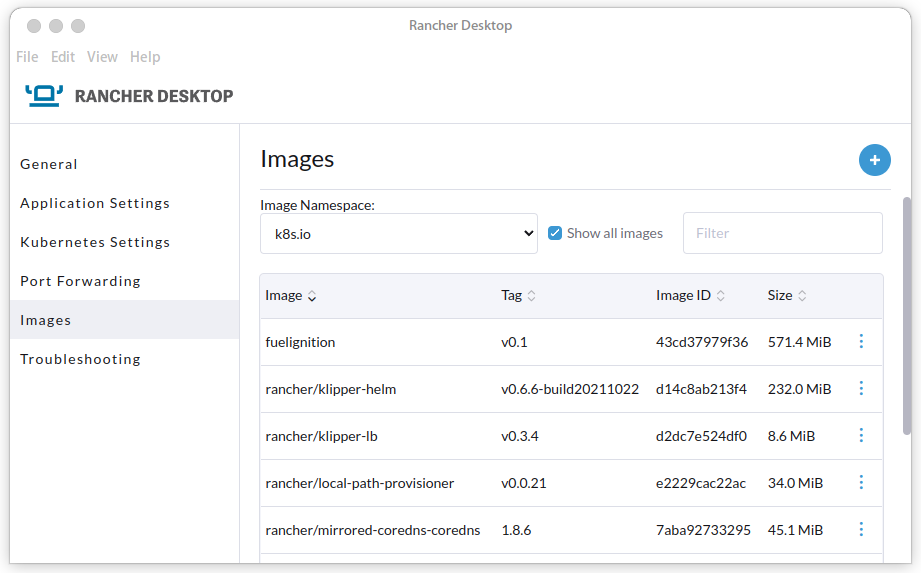

# Fuel Ignition
**Ignition & Combustion Config Generator.**
Easily generate new or edit existing Ignition configs.

No more fiddling around with JSON or Butane.

https://opensuse.github.io/fuel-ignition/


  

## Local Development

```bash
npm install
npm run dev
```

## Local Development in a container

```
$ sudo zypper in podman
$ make
$ podman run --network=host fuelignition:latest

> fuel-ignition@1.0 dev
> vite

Pre-bundling dependencies:
  vue
  @formkit/vue
  bootstrap
  vue-router
(this will be run only when your dependencies or config have changed)

  vite v2.6.14 dev server running at:

  > Local: http://localhost:3000/fuel-ignition/
  > Network: use `--host` to expose

  ready in 472ms.

$ firefox http://localhost:3000/fuel-ignition/
```

##  Local Development in Rancher-Desktop 
Add your own version tag as required, in this example v0.1 is used.

```
$ nerdctl --namespace k8s.io build -t fuelignition:v0.1 --build-arg CONTAINER_USERID=`id -u` .
```

Once the build has completed, the image should appear in Rancher-Desktop -> Images;



```
$ kubectl run --image fuelignition:v0.1 fuelignition
pod/fuelignition created

$ kubectl get pods
NAME           READY   STATUS    RESTARTS   AGE
fuelignition   1/1     Running   0          27s

$ kubectl port-forward pods/fuelignition 3000:3000 > /dev/null 2>&1 &

$ xdg-open http://localhost:3000/fuel-ignition/

```

Cleaning up

```
$ pkill -f "port-forward"
$ kubectl delete pod fuelignition
```
The created fuelignition image(s) can be deleted via Rancher-Desktop -> Images.

## Build for production

```bash
npm run build
```
dist/ contains a minified and cleaned up production build

## Notice

Fuel-ignition is still in early development and will most likely undergo massive changes.
I'm always open to feedback and enjoy hearing your thoughts. Cheers!


